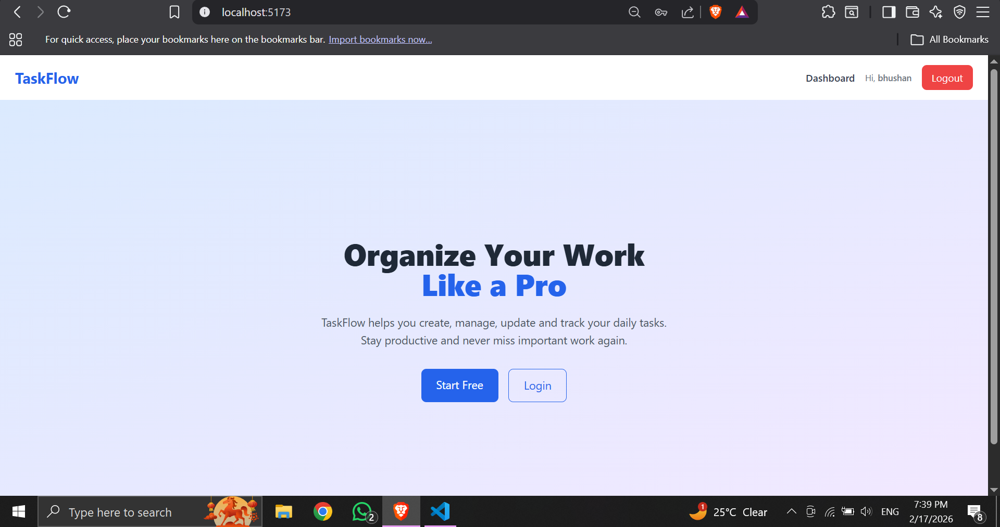
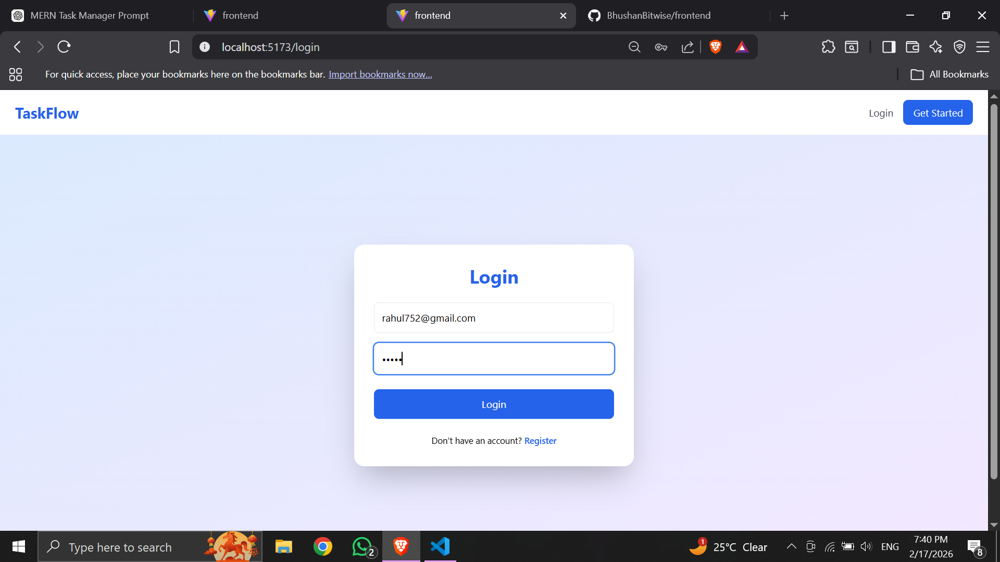
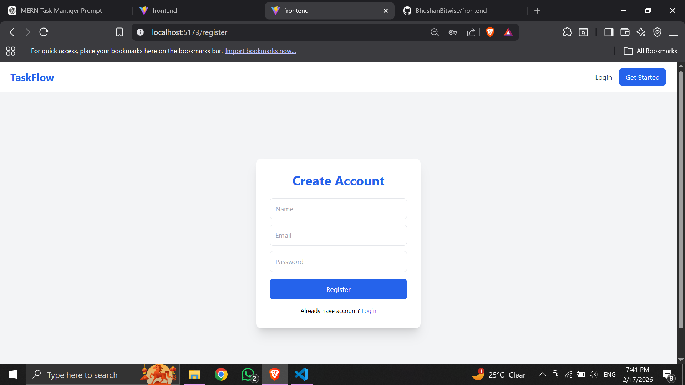
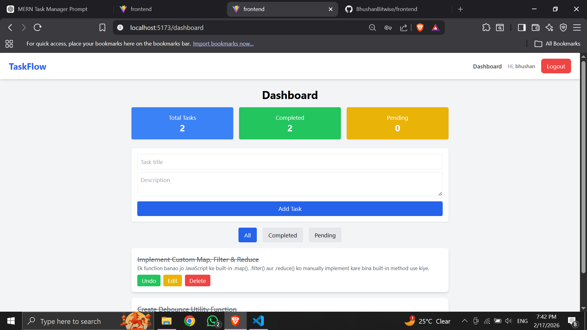
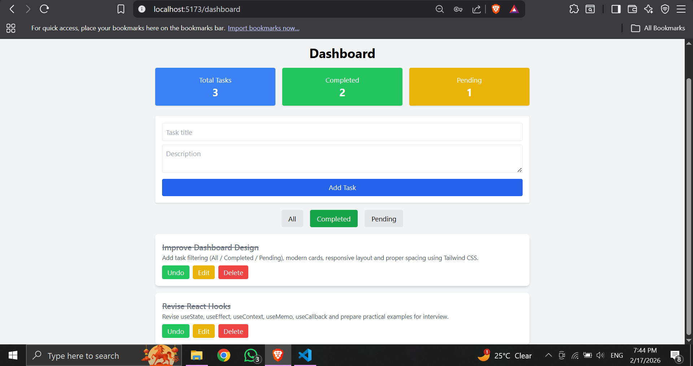

#  TaskFlow - MERN Task Manager with Authentication

A full-stack production-ready Task Management Web Application built using the MERN Stack (MongoDB, Express, React, Node.js).

TaskFlow allows users to register, login, and manage their personal tasks securely with JWT authentication.

---

##  Features

###  Authentication
- User Registration
- User Login
- JWT Authentication
- Protected Routes
- Secure Password Hashing (bcrypt)
- Auto login on refresh
- Logout functionality

###  Task Management
- Create new task
- Edit task
- Delete task
- Mark task as Completed / Pending
- Filter tasks (All / Completed / Pending)
- Task count dashboard
- User-specific tasks (Each user sees only their tasks)

###  UI Features
- Modern SaaS-style UI
- Fully Responsive
- Gradient Hero Section
- Clean Dashboard Layout
- Toast Notifications
- Loading states
- Tailwind CSS styling

---

#  Project Screenshots

##  Home Page

---

##  Login Page

---

##  Register Page

---

##  Dashboard Overview

---

##  Task Filtering & Counts

---

## 🛠 Tech Stack

### Frontend
- React (Vite)
- React Router DOM
- Axios
- Context API
- Tailwind CSS
- React Hot Toast

### Backend
- Node.js
- Express.js
- MongoDB
- Mongoose
- JWT
- bcryptjs

---

